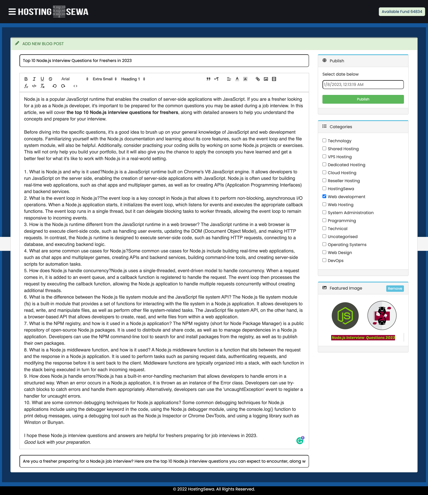

"As the founder of HostingSewa, a leading web hosting provider in Nepal, I have extensive experience in the hosting industry. I have learned firsthand the challenges that hosting companies face and have developed solutions to address them. Based on this experience, I have created HostMario, a web hosting automation software that helps hosting companies streamline their operations and increase their profitability. HostMario is the result of my deep understanding of the hosting industry and my ability to build powerful automation tools. With HostMario, hosting companies can manage and grow their businesses with ease, saving time and money in the process. I am confident that HostMario, backed by my experience in the hosting industry, will be a game-changing product in the world of web hosting." -- Rabins Sharma Lamichhane

# HostMario - Effortlessly manage and scale your hosting business with HostMario
HostMario is a web hosting automation software designed to help hosting companies manage and grow their businesses. With HostMario, you can streamline your operations, automate billing and payment processes, and provide top-notch customer support. Whether you're a small hosting company or a large enterprise, HostMario has the tools and features you need to succeed. So why wait? Try HostMario today and see the difference it can make for your business.

<table>
 <tr>
  <td width="100%" align="center">
  Login.
  </td>
  <td>
     
  
   "The HostMario login page is the gateway to accessing all the powerful features and tools of the web hosting automation software. To log in, users simply need to enter their username and password into the designated fields and click the "Log In" button. If you have forgotten your password, there is a link provided to reset it. The login page is secure, with SSL encryption protecting your personal information and ensuring that your login credentials are transmitted securely. Once logged in, users will be taken to their dashboard where they can access all the features and tools of HostMario."

  </td>
 </tr>
 <tr>
  <td width="100%" align="center">
   Clientarea
  
  </td>
  <td>
       

- The client area in HostMario is a secure portal that allows clients to access their hosting account and manage their services. The client area typically includes the following features:

- Account Overview: This page provides a summary of the client's account, including their hosting plan, usage statistics, and billing information.

- Services: This page lists all the services the client has with the hosting company, including their hosting plan, domains, and any add-ons.

- Domains: This page allows clients to manage their domains, including renewing, transferring, and updating DNS settings.

- Billing: This page provides clients with access to their invoices, payment history, and billing details.

- Support: This page provides access to the hosting company's support resources, including a ticketing system, knowledgebase, and contact information.

- Account Settings: This page allows clients to update their personal and billing information, change their password, and manage their hosting account.

The client area is an essential part of HostMario, as it provides a central location for clients to manage their hosting services and get support when needed.  </td>
 </tr>
 <tr>
  <td width="100%" align="center">
  Clientarea Domains
  </td>
  <td>
      
 

   The clientarea domains page in HostMario allows clients to manage their domains registered with the hosting company. This page typically includes the following features:

- Domain List: A list of all the domains registered under the client's account, including their expiration date and status.

- Domain Search: A search bar that allows clients to quickly find a specific domain in their account.

- Domain Management: Tools and options for managing the client's domains, including renewing, transferring, and updating DNS settings.

- Domain Registration: A form for registering new domains, with options to choose the domain name, extension, and registration period.

- Domain Pricing: Information on the pricing for different domain extensions and registration periods.

The clientarea domains page is a key part of HostMario, as it allows clients to easily manage their domains and keep them up-to-date. It also provides an opportunity for hosting companies to upsell additional domain registration services to their clients.</td>
 </tr>
 <tr>
  <td width="100%" align="center">
   Clientarea Tickets
  </td>
  <td>
     
     
   The clientarea tickets page in HostMario is a support feature that allows clients to submit and track support tickets with the hosting company. This page typically includes the following features:

- Ticket List: A list of all the support tickets that the client has submitted, including their status and the date they were created.

- Ticket View: A detailed view of a specific support ticket, including the conversation history, attachments, and any notes or updates.

- Ticket Submission: A form for submitting a new support ticket, with options to choose the ticket category, subject, and message.

 
   
 

- Ticket Search: A search bar that allows clients to quickly find a specific ticket in their account.

- Knowledgebase: A library of articles and resources that clients can use to troubleshoot common issues and find solutions.

The clientarea tickets page is an important part of HostMario, as it provides a convenient way for clients to get help and support from the hosting company. It also helps hosting companies to efficiently manage and resolve client support requests.
  </td>
 </tr>
 <tr>
  <td width="100%" align="center">
   Clientarea Invoices
  </td>
  <td>
     

     

    The clientarea invoices page in HostMario is a billing feature that allows clients to view and pay their invoices with the hosting company. This page typically includes the following features:

- Invoice List: A list of all the invoices that the client has received, including their due date, amount, and status.

- Invoice View: A detailed view of a specific invoice, including the items and charges, payment history, and any notes or updates.

- Invoice Payment: Options for paying the invoice, including online payment methods such as credit card or PayPal.

- Invoice Search: A search bar that allows clients to quickly find a specific invoice in their account.

- Payment History: A record of all the payments that the client has made to the hosting company. 

 
   
 
The clientarea invoices page is a crucial part of HostMario, as it allows clients to stay up-to-date on their billing and make payments on time. It also helps hosting companies to efficiently manage and track their revenue.
  </td>
 </tr>
 <tr>
  <td width="100%" align="center">
 Clientarea Add Funds
  </td>
  <td>
       

   

The clientarea add funds page in HostMario is a billing feature that allows clients to add funds to their account balance with the hosting company. This page typically includes the following features:

Balance Overview: A summary of the client's current account balance, including any available credits or unpaid invoices.

Add Funds Form: A form for adding funds to the client's account, with options to choose the payment amount and method.

Payment History: A record of all the payments that the client has made to the hosting company, including any fund additions.

Credit Expiration: Information on the expiration date for any credits added to the client's account.

The clientarea add funds page is a useful feature of HostMario, as it allows clients to easily add funds to their account and use them to pay for hosting services. It also helps hosting companies to provide flexible billing options to their clients.  </td>
 </tr>
 <tr>
  <td width="100%" align="center">
  Clientarea Services
  </td>
  <td>
     
    
   The clientarea services page in HostMario is a feature that allows clients to manage their hosting services with the hosting company. This page typically includes the following features:

- Service List: A list of all the hosting services that the client has with the company, including their type, status, and expiration date.

- Service View: A detailed view of a specific hosting service, including the service details, usage statistics, and any notes or updates.

- Service Management: Tools and options for managing the client's hosting services, including upgrading, downgrading, and canceling.

- Service Upgrade: A form for upgrading the client's hosting service to a higher plan, with options to choose the new plan and billing period.

- Service Pricing: Information on the pricing for different hosting plans and billing periods.

The clientarea services page is an important part of HostMario, as it allows clients to easily manage their hosting services and make changes as needed. It also provides an opportunity for hosting companies to upsell additional services to their clients.
 </td>
 </tr>
 <tr>
  <td width="100%" align="center">
   Admin Blogs
  </td>
  <td>
      
   

   The admin blogs page in HostMario is a feature that allows the hosting company's administrator to manage and publish blog posts on the company's website. This page typically includes the following features:

- Blog List: A list of all the blog posts that have been published on the company's website, including their title, author, and publish date.

- Blog View: A detailed view of a specific blog post, including the post content, images, and any notes or updates.

- Blog Editor: A tool for creating and editing blog posts, including options for formatting text, inserting images, and setting the publish date.

- Blog Categories: A system for organizing blog posts into categories, with options to create and edit categories.

- Blog Comments: A feature for allowing readers to leave comments on blog posts, with options for moderating and approving comments.

The admin blogs page is a useful feature of HostMario, as it allows the hosting company to easily publish and manage blog content on their website. It also provides an opportunity for the company to engage with their audience and build a community around their blog.
  </td>
 </tr>
 <tr>
  <td width="100%" align="center">
  Login
  </td>
  <td>
      
  
   The login page in HostMario is a feature that allows clients and administrators to access their account with the hosting company. This page typically includes the following features:

Login Form: A form for entering the client's or administrator's username and password to log in to their account.

Remember Me: An option for saving the client's or administrator's login credentials to the device for future use.

Forgotten Password: A link for resetting the client's or administrator's password if they have forgotten it.

Sign Up: A link for creating a new account with the hosting company.

The login page is a fundamental feature of HostMario, as it provides a secure and convenient way for clients and administrators to access their account. It also helps the hosting company to protect the privacy and security of their clients and administrators.
  </td>
 </tr>

 <tr>
  <td width="100%" align="center">
  Create MongoDB
  </td>
  <td>
      
  
   The clientarea MongoDB page in HostMario is a feature that allows clients to manage their databases using the MongoDB database management system. This page typically includes the following features:

- Database List: A list of all the databases that the client has with the hosting company, including their name, size, and usage statistics.

- Database View: A detailed view of a specific database, including the database schema, data collections, and any notes or updates.

- Database Management: Tools and options for managing the client's databases, including creating, renaming, and deleting databases.

- Database Import/Export: Features for importing and exporting data to and from the client's databases, with options to choose the file format and data source.

- Database Statistics: Graphs and charts showing the usage and performance of the client's databases over time.

The clientarea MongoDB page is an important part of HostMario, as it allows clients to easily manage their databases and work with data using the powerful and flexible MongoDB system. It also provides an opportunity for the hosting company to offer advanced database management services to their clients.
  </td>
 </tr>

</table>

## Features

- Automated hosting account setup and management: HostMario can handle the entire process of setting up and managing hosting accounts, including provisioning, suspension, modification, and termination.

- Recurring invoicing and payment capture: HostMario can automatically bill and collect payments from customers, making it easy to run a profitable hosting business.
Centralized customer communications: HostMario has a built-in ticketing system and self-service tools to help you manage customer inquiries and support requests.

- Wide range of order form styles: HostMario offers a variety of order form styles to choose from, allowing you to showcase your products in a way that best fits your brand and target audience.

- Automatic account suspension: HostMario can automatically suspend overdue and delinquent accounts, helping you keep your hosting business running smoothly.

- Payment reminders and overdue notices: HostMario can send payment reminders and overdue notices to customers to ensure that you receive timely payments.

- Integration with leading control panels: HostMario integrates seamlessly with popular control panels like cPanel, giving you easy access to billing and support resources.

- Self-service client portal: HostMario provides a self-service client portal that allows customers to manage all aspects of their hosting accounts without requiring assistance from you.

- Automatic updates: HostMario can automatically download and apply updates to the product, ensuring that you have the latest features and security fixes.

- Daily usage statistics: HostMario imports disk and bandwidth usage data daily, and supports usage-based billing to help you optimize your pricing and plans.

- Domain resolver: HostMario can automatically detect domains that have been removed from your nameservers, helping you keep your hosting business running smoothly.

- Product bundles: HostMario allows you to create bundles of products and services to group commonly used services, making it easier for customers to purchase and manage their hosting accounts.

- Automatic domain registration, renewals, and management: HostMario integrates with major domain registrars to provide automatic domain registration, renewal, and management, saving you time and effort.

- Intelligent domain name suggestions: HostMario can provide intelligent domain name suggestions to help you increase your chances of securing a sale and upselling additional names.

- Easy domain transfers: HostMario makes it easy for customers to transfer their domains to you, with a simple order process, automatic EPP coderequest, automatic transfer initiation, and automated status updates.

- Spotlight TLD extensions: HostMario allows you to highlight your top-performing and new/premium domain extensions using spotlight TLDs, helping you promote your best-selling products and special offers.

- Real-time availability checking: HostMario uses real-time polling of WHOIS services and registrar APIs to check domain availability in real-time.

- Nameserver management: HostMario allows both customers and administrators to view and change the nameservers associated with a domain.

- Automatic renewal reminders: HostMario can send automatic renewal reminders to customers to help ensure that their domains don't expire.

- Domain registration add-ons: HostMario supports domain registration add-ons such as ID protection and domain privacy.

- Real-time domain transfer status updates: HostMario provides real-time updates on the status of domain transfers, so you and your customers can stay informed.

- Advanced domain search: HostMario has an advanced domain search function that allows customers to search for available domains using a variety of filters.

- Bulk domain management: HostMario allows you to manage multiple domains at once, making it easy to update contact information, request transfers, and more.

- Custom domain fields: HostMario supports custom domain fields, allowing you to capture additional information from your customers during the domain registration process.

- Multiple domain pricing groups: HostMario allows you to create multiple domain pricing groups, making it easy to offer different pricing for different types of domains.

- Domain registration price overrides: HostMario allows you to override the default pricing for specific domains, making it easy to offer special discounts or promotions.

- Domain suggestions engine: HostMario includes a domain suggestions engine that can help you upsell additional domain names to your customers.

### Need your support
"I am working on an exciting new project called HostMario, a web hosting automation software that helps hosting companies manage and grow their businesses. As I am currently working a full-time job, I have limited time to dedicate to this project. That's why I am seeking donations to help me complete it.

With your support, I will be able to focus more time and energy on developing HostMario and bringing it to market. This will not only benefit me, but also the many hosting companies that will be able to use this software to streamline their operations and increase their profitability.

Any amount you can contribute will make a difference and help bring HostMario closer to completion. Thank you in advance for your generosity and support. Together, we can make HostMario a reality and help revolutionize the web hosting industry."

<h3 align="left">Support:</h3>

